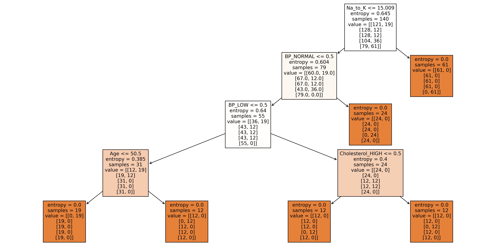

# Árvore de Decisão - Classificação

## Exercício Proposto:

    Este trabalho consiste na execução e validação do algoritmo de aprendizado supervisionado para
    classificação (árvore de decisão) estudado na disciplina, com o uso de classes e funções disponíveis
    em bibliotecas Python e descritas neste documento.

    O conjunto de dado pode ser selecionado de repositórios públicos como UCI
    (http://archive.ics.uci.edu/ml/), site da ferramenta Weka (http://www.cs.waikato.ac.nz/ml/weka/) ou
    kaggle (https://www.kaggle.com/datasets). Conjuntos de dados do pacote sklearn.datasets NÃO
    podem ser usados, visto que impedem os alunos lidarem com questões importantes, tais como leitura
    e transformação de dados. As etapas que devem ser executadas e relatadas são:
    <ul>
        <li align = "justify">
            Selecionar conjunto de dados adequado para problemas de classificação (conjunto com classes nominais) e ler o conjunto de dados no formato .csv com a função read.csv(...) (biblioteca Pandas);
        </li>
        <li align = "justify">
            Separar o conjunto de dados em matriz de atributos (X) e vetor de classes (y);
        </li>
        <li align = "justify">
            Usando a biblioteca sckit-learn, transformar os atributos nominais em binários (se existirem), já que a implementação de Árvore de decisão do scikit-learn não aceita atributos categóricos, usando a classe OneHotEnconder do módulo sklearn.preprocessing ou usando a função get_dummies(...) da biblioteca Pandas. Embora essa tarefa tenha sido apresentada de forma sucinta na disciplina, essa é uma ótima oportunidade para o aluno explorar e entender melhor esse conceito simples;
        </li>
        <li align = "justify">
            Dividir o conjunto de dados em um conjunto de treinamento e um conjunto de teste usando a função train_test_split do módulo sklearn.model_selection;
        </li>
        <li align = "justify">
            Aplicar o algoritmo de indução de árvore de decisão no conjunto de treinamento usando a função fit(...) da classe DecisionTreeClassifier do módulo sklearn.tree, com o atributo criterion="entropy";
        </li>
        <li align = "justify">
            Gerar a figura da árvore de decisão com a função plot_tree(...) do módulo sklearn.tree;
        </li>
        <li align = "justify">
            Fazer a classificação dos dados de teste usando a função predict(...) da classe DecisionTreeClassifier do módulo sklearn.tree;
        </li>
        <li align = "justify">
            Fazer a avaliação do modelo gerado usando os dados de teste e mostrar os resultados incluindo matriz de confusão, acurácia, precisão, revocação e medida-F, possivelmente usando funções disponíveis no sklearn para cada medida individualmente. Porém, não é permitido usar a função classification_report(...) do modulo sklearn.metrics, vocês podem utilizar as métricas de classificação separadamente do próprio sklearn. A função classification_report(...) é utilizada para usuários avançadas, uma vez que já retorna o cálculo de várias métricas e análises, o que prejudica o entendimento do aluno perante os conceitos de cada métrica.
        </li>
    </ul>

## Resultado:

  

## Licença
[MIT](https://choosealicense.com/licenses/mit/)

    Código desenvolvido para atividade da disciplina de  Inteligência Artificial da Universidade Federal de São Carlos (UFSCar).

